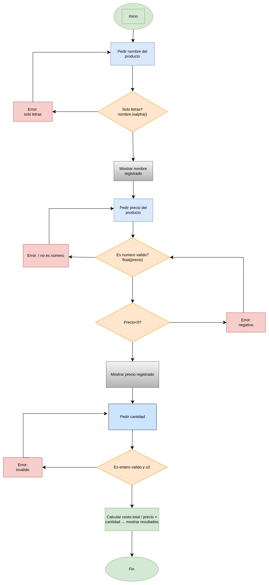

# 🛒 Registro de Producto

Script en Python que solicita al usuario los datos de un producto (nombre, precio y cantidad), los valida y muestra un resumen con el costo total.

---

## ¿Qué hace?

1. Pide el **nombre** del producto → solo acepta letras
2. Pide el **precio** → solo acepta números decimales positivos
3. Pide la **cantidad** → solo acepta números enteros positivos
4. Calcula e imprime el **costo total** (precio × cantidad)

---

## Ejemplo de uso

```
Ingresa el nombre del producto: Manzana
Producto 'Manzana' registrado

Ingresa precio del producto: 1500.50
Precio del producto 'Manzana' registrado: 1500.50$

Ingresa la cantidad de productos: 3
3 'Manzana' registradas.

==========
RESULTADOS
==========
Producto: Manzana
Precio: 1500.50$
Cantidad: 3
Costo total: 4501.50$
==========
```

---

## Validaciones

| Campo    | Regla                          | Error si...                        |
|----------|--------------------------------|------------------------------------|
| Nombre   | Solo letras                    | Contiene números o símbolos        |
| Precio   | Número decimal positivo        | Es texto o un número negativo      |
| Cantidad | Número entero positivo         | Es texto o un número negativo      |

Si el usuario ingresa un valor inválido, el programa **muestra un mensaje de error y vuelve a preguntar** hasta recibir un dato correcto.

---

## Requisitos

- Python 3.x
- No requiere librerías externas

## Ejecución

```bash
python registro_producto.py
```

